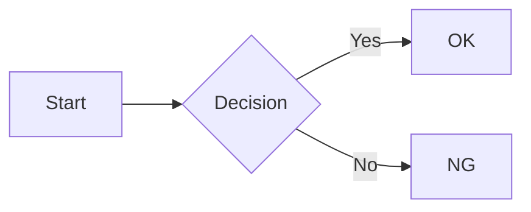

# Docker Test Document

This is a test document for verifying mdskim setup and rendering.

## Mermaid Diagram



## Math Formula

Inline math: $E = mc^2$

Display math:

$$
\int_0^\infty e^{-x^2} dx = \frac{\sqrt{\pi}}{2}
$$

## Table

| Feature  | Status |
|----------|--------|
| Mermaid  | OK     |
| Math     | OK     |
| PDF      | OK     |

## Code Block

```rust
fn main() {
    println!("Hello from mdskim!");
}
```

End of test document.
