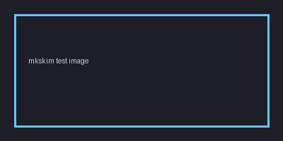
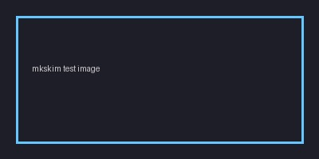
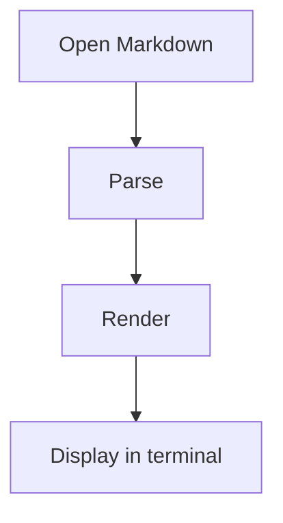
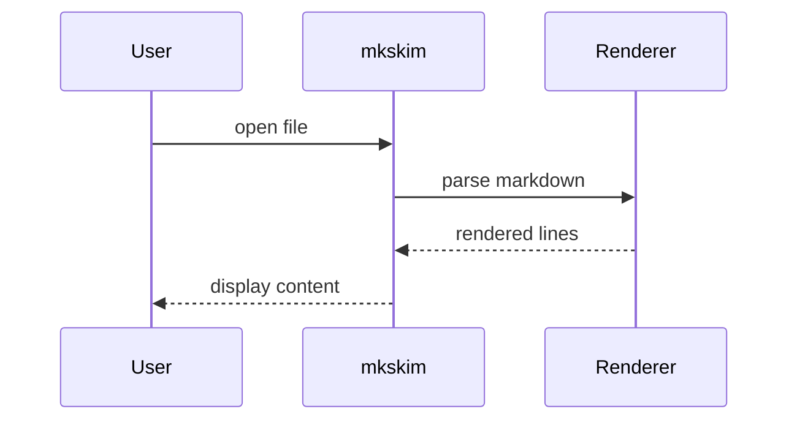
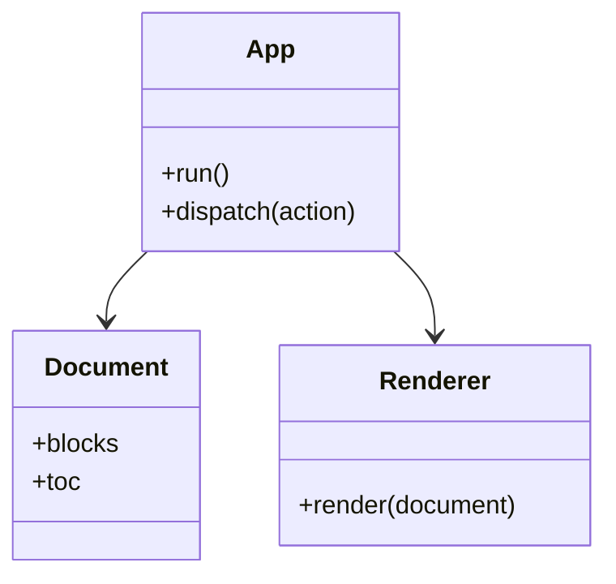
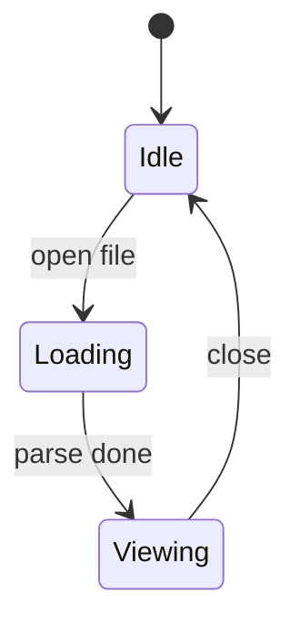
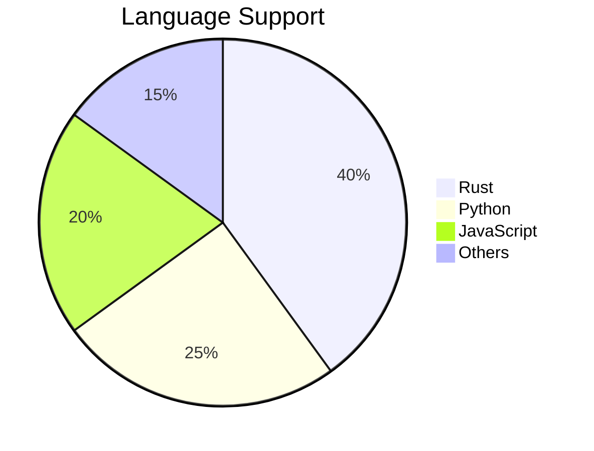
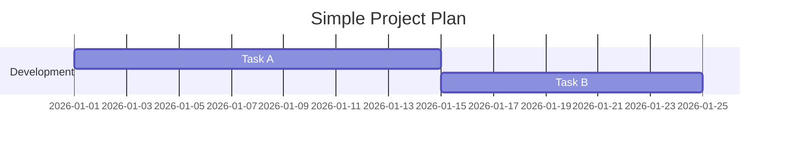
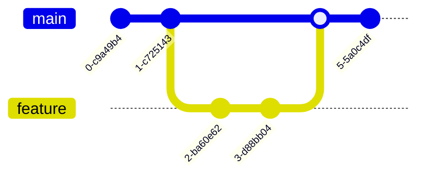

# mkskim Rendering Test Fixture

> This file is a comprehensive Markdown fixture for testing `mkskim` rendering.
> It includes common Markdown features, edge cases, Unicode, and Mermaid blocks.

---

## Table of Contents

1. [Headings](#headings)
2. [Paragraphs and Line Breaks](#paragraphs-and-line-breaks)
3. [Text Styles](#text-styles)
4. [Lists](#lists)
5. [Blockquotes](#blockquotes)
6. [Code](#code)
7. [Links and Autolinks](#links-and-autolinks)
8. [Images](#images)
9. [Tables](#tables)
10. [Task Lists](#task-lists)
11. [Horizontal Rules](#horizontal-rules)
12. [Definition-like Patterns](#definition-like-patterns)
13. [Escaping](#escaping)
14. [HTML Blocks and Inline HTML](#html-blocks-and-inline-html)
15. [Footnotes](#footnotes)
16. [Math](#math)
17. [Mermaid](#mermaid)
18. [Long Lines and Wrapping](#long-lines-and-wrapping)
19. [Unicode and Wide Characters](#unicode-and-wide-characters)
20. [Mixed Nesting Stress Test](#mixed-nesting-stress-test)
21. [Final Notes](#final-notes)

---

# Headings

# H1 Heading
## H2 Heading
### H3 Heading
#### H4 Heading
##### H5 Heading
###### H6 Heading

Normal paragraph after headings.

## Alternate heading styles

Heading Level 1
===============

Heading Level 2
---------------

---

# Paragraphs and Line Breaks

This is a normal paragraph with regular wrapping behavior. It should reflow nicely depending on terminal width.

This is a second paragraph.

This line ends with two spaces for a hard line break.  
This line should appear directly after a hard break.

This paragraph contains
a literal newline in source
but should still be part of the same paragraph in many Markdown renderers.

---

# Text Styles

Plain text.

*Italic text*  
_Italic text with underscores_

**Bold text**  
__Bold text with underscores__

***Bold and italic***  
___Bold and italic with underscores___

~~Strikethrough~~

`inline code`

Here is text with **bold**, *italic*, `code`, and a [link](https://example.com) in the same sentence.

Nested emphasis example: **bold with _italic inside_ and `code` nearby**.

---

# Lists

## Unordered lists

- Item one
- Item two
- Item three

* Star bullet
* Another star bullet

+ Plus bullet
+ Another plus bullet

## Ordered lists

1. First
2. Second
3. Third

1. Ordered list with nested items
   - Nested unordered
   - Nested unordered 2
     1. Nested ordered
     2. Nested ordered 2
2. Back to top level

## Deep nesting

- Level 1
  - Level 2
    - Level 3
      - Level 4
        - Level 5

## Loose vs tight lists

- Tight item A
- Tight item B
- Tight item C

- Loose item A

- Loose item B with second paragraph

  Continued paragraph in same list item.

- Loose item C

## List items with code blocks

- Item before code

  ```rust
  fn main() {
      println!("Hello from nested code block");
  }
  ```

- Item after code

---

# Blockquotes

> Simple blockquote.

> Multi-line blockquote
> continues here
> and here.

> Nested structures inside blockquote:
>
> - Quoted list item
> - Another item
>
> ```txt
> quoted code block
> ```
>
> Final quoted paragraph.

> > Nested blockquote level 2
> >
> > - deep nested list
> > - another point

---

# Code

## Fenced code blocks

```text
Plain text code block
with multiple lines
and indentation.
```

```rust
use std::io;

fn main() -> io::Result<()> {
    println!("mkskim");
    Ok(())
}
```

```python
def greet(name: str) -> None:
    print(f"Hello, {name}")

greet("world")
```

```json
{
  "name": "mkskim",
  "version": "0.1.0",
  "features": ["vim", "markdown", "mermaid"]
}
```

```bash
mkskim README.md
cat README.md | mkskim -
```

## Indented code block

    This is an indented code block.
    It should remain preformatted.
        With deeper indentation preserved.

## Code fence edge cases

````markdown
```rust
fn nested() {}
```
````

---

# Links and Autolinks

Inline link: [Example](https://example.com)

Reference-style link: [Rust][rust-site]

Collapsed reference link: [Rust][]

Autolink URL: <https://example.org/docs>

Autolink email: <dev@example.com>

Bare URL (parser-dependent): https://example.net/path?q=1&lang=en

[rust-site]: https://www.rust-lang.org
[Rust]: https://www.rust-lang.org/tools/install

---

# Images

## PNG image



## JPEG image



## SVG image


## Reference image

![Reference alt][img-ref]

[img-ref]: ./images/example.png "Optional title"

## Remote image


## Missing image (fallback test)


## Image with no alt text


## Image in a list

- Item with image: 
- Another item

## Image in a blockquote

> Quoted image:
>
> 

## Image with title attribute


## Base64 inline image


---

# Tables

| Name    | Type      | Notes                  |
|---------|-----------|------------------------|
| mkskim  | CLI/TUI   | Main application       |
| glow    | CLI       | Markdown viewer        |
| mmdc    | Renderer  | Mermaid external tool  |

| Left | Center | Right |
|:-----|:------:|------:|
| a    |   b    |     c |
| 1    |   2    |     3 |

Table with inline formatting:

| Syntax | Example |
|--------|---------|
| Bold   | **text** |
| Italic | *text* |
| Code   | `code()` |

---

# Task Lists

- [ ] unchecked task
- [x] checked task
- [ ] task with `inline code`
- [x] task with a [link](https://example.com)

Nested tasks:

- [ ] parent task
  - [x] child task 1
  - [ ] child task 2

---

# Horizontal Rules

Above this text.

---

Between rules.

***

Between different rule styles.

___

Below the last rule.

---

# Definition-like Patterns

Term
: Definition-style content often used in some Markdown flavors.

Another Term
: First line of definition
: Second line of definition

This section is useful even if your parser does not support actual definition lists; it still tests punctuation-heavy layout.

---

# Escaping

\*This should not be italic\*

\`This should not be inline code\`

\# This should not become a heading

Escaped brackets: \[not a link\]

Escaped backslash: \\

---

# HTML Blocks and Inline HTML

Inline HTML: <kbd>Ctrl</kbd> + <kbd>J</kbd>

<span data-test="inline-html">Inline span element</span>

<div>
  <strong>HTML block content</strong><br />
  <em>Second line in raw HTML block</em>
</div>

<details>
  <summary>Expandable HTML block</summary>
  Hidden-ish content for parsers that pass raw HTML through.
</details>

---

# Footnotes

Here is a footnote reference.[^1]

Another footnote with more text.[^long-note]

[^1]: This is the first footnote.
[^long-note]: This is a longer footnote that includes multiple sentences and should test how footnotes are laid out or ignored by the renderer.

---

# Math

## Inline math

Einstein's famous equation $E = mc^2$ relates energy and mass.

The quadratic formula gives $x = \frac{-b \pm \sqrt{b^2 - 4ac}}{2a}$ for any $ax^2 + bx + c = 0$.

Multiple inline expressions: $\alpha + \beta = \gamma$ and $\sin^2\theta + \cos^2\theta = 1$ on one line.

Greek letters are common in math: $\pi \approx 3.14159$, $e \approx 2.71828$, $\phi = \frac{1+\sqrt{5}}{2}$.

## Display math

Basic integral:

$$
\int_0^1 x^2 dx = \frac{1}{3}
$$

Summation (Euler's identity approach):

$$
e^{i\pi} + 1 = 0
$$

Matrix notation:

$$
\mathbf{A} = \begin{pmatrix} a & b \\ c & d \end{pmatrix}, \quad \det(\mathbf{A}) = ad - bc
$$

Multi-line aligned equations:

$$
\nabla \cdot \mathbf{E} = \frac{\rho}{\varepsilon_0}
$$

Limits and series:

$$
\sum_{n=1}^{\infty} \frac{1}{n^2} = \frac{\pi^2}{6}
$$

## Math in context

The Pythagorean theorem states that $a^2 + b^2 = c^2$. For a right triangle with legs $a = 3$ and $b = 4$, the hypotenuse is $c = 5$.

## Long formula

$$
\int_0^\infty e^{-x^2} dx + \sum_{k=0}^{n} \binom{n}{k} x^k + \prod_{i=1}^{N} \frac{1}{1 - q^i}
$$

## Align environment

$$
\begin{align}
a &= b + c \\
d + e &= f \\
g &= h + i + j + k
\end{align}
$$

## Japanese text in math

速度 $v$ は距離 $d$ と時間 $t$ の比: $v = \frac{d}{t}$

$$
\text{面積} = \pi r^2
$$

## Math edge cases

Invalid LaTeX (error handling test): $\invalid{command}$

Cases environment:

$$
f(x) = \begin{cases} x^2 & \text{if } x \geq 0 \\ -x & \text{if } x < 0 \end{cases}
$$

---

# Mermaid

## Mermaid flowchart



## Mermaid sequence diagram



## Mermaid class diagram



## Mermaid state diagram



## Mermaid pie chart



## Mermaid with invalid content (error handling)

```mermaid
this is not valid mermaid
```

## Empty mermaid block

```mermaid
```

## Mermaid ER diagram

```mermaid
erDiagram
    USER ||--o{ POST : writes
    USER ||--o{ COMMENT : posts
    POST ||--o{ COMMENT : has
    USER {
        int id
        string name
        string email
    }
    POST {
        int id
        string title
        string body
    }
    COMMENT {
        int id
        string text
    }
```

## Mermaid Gantt chart



## Mermaid Git graph



---

# Long Lines and Wrapping

This is a deliberately long paragraph intended to test how line wrapping behaves in a terminal UI when the viewport width changes significantly from very narrow to very wide, including whether indentation, inline code like `some_function_call(argument_one, argument_two, argument_three)`, and punctuation remain visually coherent.

VeryLongUnbrokenTokenForOverflowTesting_ABCDEFGHIJKLMNOPQRSTUVWXYZ_0123456789_abcdefghijklmnopqrstuvwxyz_ThisShouldStressWrappingOrClippingBehavior

Path-like long token:
/home/user/projects/mkskim/src/render/markdown/really_long_module_name_that_keeps_going_and_going_until_it_becomes_annoying.rs

---

# Unicode and Wide Characters

Japanese: これは日本語の文章です。見出し、段落、折り返しの挙動を確認します。

Emoji: 😀 😎 🚀 🦀 📘 ✅ ❌

Mixed width:
ASCII abc123
全角ＡＢＣ１２３
half and 全角 mixed 123 テスト ABC

Box drawing:
┌─────────────┐
│ mkskim test │
└─────────────┘

Greek: α β γ δ ε  
Cyrillic: Привет мир  
Arabic: مرحبا بالعالم

Combining characters:
é ä ô ñ

---

# Mixed Nesting Stress Test

> Blockquote level 1
>
> 1. Ordered item in quote
>    - Nested unordered item
>      - Deeper nested item with `inline code`
>      - Another item with **bold**
>    - Another unordered item
>
> 2. Second ordered item
>
>    ```rust
>    fn inside_quote() {
>        println!("nested");
>    }
>    ```
>
> > Nested quote level 2
> >
> > - [x] task in nested quote
> > - [ ] another task
> >
> > | Col1 | Col2 |
> > |------|------|
> > | A    | B    |

- Top-level list after blockquote
  > Quoted paragraph inside list item
  >
  > ```python
  > print("list + quote + code")
  > ```
  1. Ordered sub-list
  2. Another item
     - [x] Task under ordered item
     - [ ] Another task

---

# Definition Lists (Extended)

Inline code in definition
  : A `term` can contain `inline code` in its definition.

Nested definitions

First Term
  : Primary definition
  : Alternative definition

Second Term
  : Definition with **bold** and *italic* formatting

---

# Large Table

| #  | Name     | Type    | Status   | Priority | Notes                      |
|----|----------|---------|----------|----------|----------------------------|
| 1  | Alpha    | Feature | Done     | High     | Core functionality         |
| 2  | Beta     | Bug     | Open     | Medium   | Edge case in parser        |
| 3  | Gamma    | Feature | Open     | Low      | Nice to have               |
| 4  | Delta    | Task    | Done     | High     | Infrastructure             |
| 5  | Epsilon  | Bug     | Closed   | High     | Fixed in v0.2              |
| 6  | Zeta     | Feature | Open     | Medium   | Requires design review     |
| 7  | Eta      | Task    | Open     | Low      | Documentation update       |

---

# 日本語コンテンツ

## 概要

これは日本語のみのセクションです。見出し、段落、リスト、コードブロックの表示を確認します。

## 機能一覧

- マークダウンの表示
- Vimライクなナビゲーション
- Mermaidダイアグラム対応
- 数式レンダリング

### コード例

```rust
fn main() {
    println!("こんにちは、世界！");
}
```

> 引用: 日本語のブロック引用テスト。
> 複数行にわたる引用の折り返しを確認。

| 項目 | 説明 |
|------|------|
| 名前 | mdskim |
| 種類 | ターミナルツール |
| 言語 | Rust |

---

# Deep Nesting

- Level 1
  - Level 2
    - Level 3
      - Level 4
        - Level 5
          - Level 6
            - Level 7: deepest item

---

# Long Footnotes

This paragraph references a complex footnote.[^complex]

[^complex]: This is a long footnote with `inline code` and **bold text**. It spans multiple sentences to test how the renderer handles longer footnote content.

---

# Blockquote with Definition List

> Term inside blockquote
> : This is a definition inside a blockquote. It tests whether definition list
> syntax is recognized within quoted context.
>
> Another term
> : Another definition with **bold** and `code` formatting.

---

# Final Notes

Use this file to test:

- parsing correctness
- line wrapping
- scrolling
- heading extraction
- search behavior
- code block styling
- task list rendering
- table rendering
- image rendering (PNG, JPEG, SVG, remote)
- Mermaid detection and rendering
- Mermaid fallback behavior
- Math rendering (inline and display)
- definition lists
- Unicode width handling
- nested structure stability
- Japanese content rendering

End of fixture.
